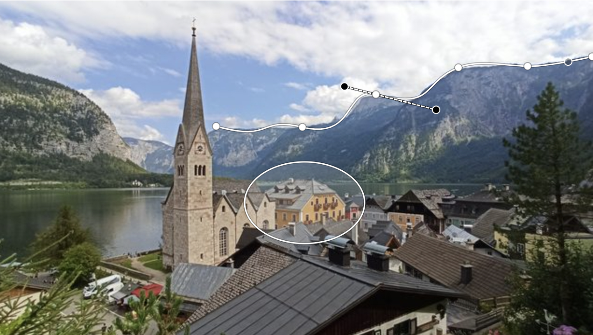

# Annotorious Tools Plugin

An Annotorious plugin that adds additional drawing tools.



## Installation

```sh
npm install @annotorious/plugin-tools
```

## Tools

### 1. Ellipse

Draw ellipses or circles.

- Hold `SHIFT` – Constrain aspect ratio to circle
- Hold `CTRL` – Draw from the center outward

### 2. Line

Draw a straight line between two points.

### 3. Path

Create polylines made of straight or curved segments.

**Drawing:**

- Click (or click and drag if `drawingMode` is set to `drag`) to start.
- Click to add more points.
- **Open path:** Double-click to finish.
- **Closed shape:** Click back on the first point.

**Editing:**

- **Delete points:** Press `Del` or `Backspace` while a point is selected to remove that point from the path.
- **Toggle corner/curve:** Hold `Alt` (or `Option` on Mac) and click a point to switch between corner and smooth curve (handles will appear).
- **Adjust curvature:** Drag the handles to refine the shape.
- **Sharp corner between curves:** Hold `Alt` (or `Option` on Mac) while dragging a handle to move it independently.
- **Re-link handles:** Double-click the point to snap handles back together.

## Usage

The plugin works with both Annotorious versions: **Image Annotator** and **OpenSeadragon Annotator**.

### Image Annotator

```js
import { createImageAnnotator } from '@annotorious/annotorious';
import { mountPlugin as mountToolsPlugin } from '@annotorious/plugin-tools';

import '@annotorious/annotorious/annotorious.css';
import '@annotorious/plugin-tools/annotorious-plugin-tools.css';

var anno = createImageAnnotator('sample-image', {
  /** Annotorious init options **/
});

mountToolsPlugin(anno);

// ['rectangle', 'polygon', 'ellipse', 'line', 'path']
console.log(anno.listDrawingTools());

anno.setDrawingTool('path');
```

### OpenSeadragon Annotator

```js
import OpenSeadragon from 'openseadragon';
import { createOSDAnnotator } from '@annotorious/openseadragon';
import { mountPlugin as mountToolsPlugin } from '../src';

import '@annotorious/openseadragon/annotorious-openseadragon.css';
import '@annotorious/plugin-tools/annotorious-plugin-tools.css';

const viewer = OpenSeadragon({
  /** OpenSeadragon init options **/
});

const anno = createOSDAnnotator(viewer, {
  /** Annotorious init options **/
});

mountToolsPlugin(anno);

// ['rectangle', 'polygon', 'ellipse', 'line', 'path']
console.log(anno.listDrawingTools());

anno.setDrawingTool('path');
```


